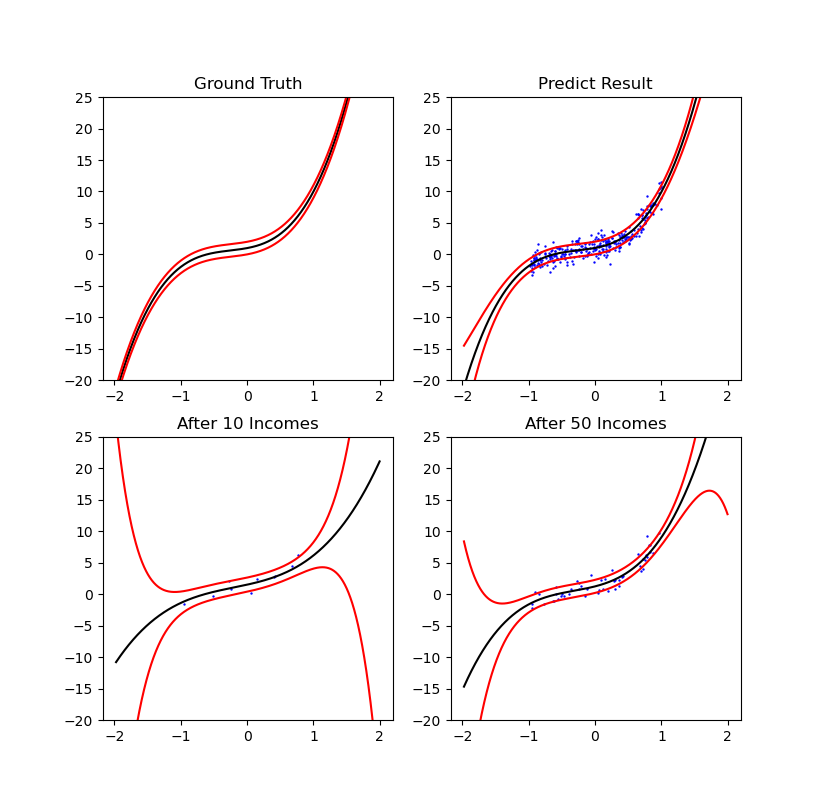
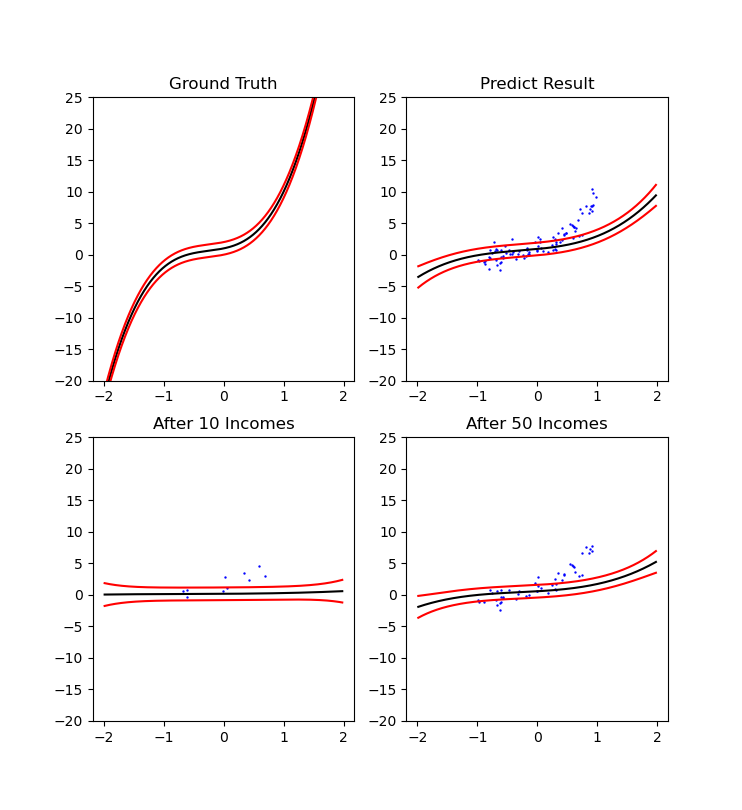
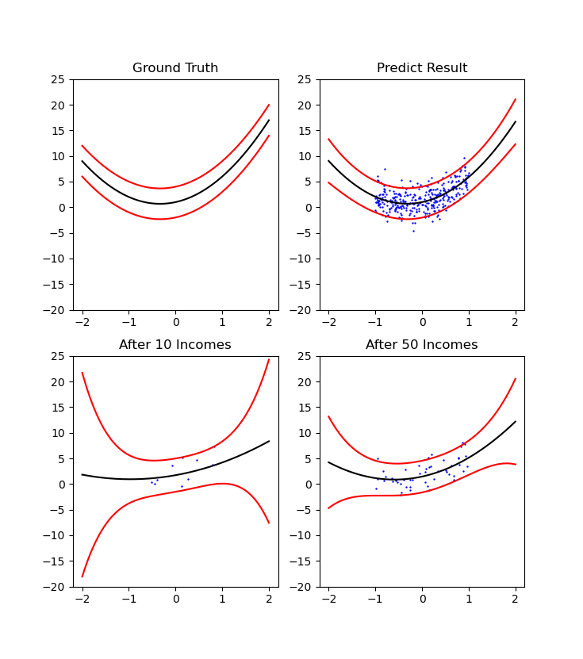

# Lab 3: Baysian Linear Regression

This lab includes three task：
- Data Generator
- Sequntial Estimator
- Baysian Linear Regression

## Data Generator

In **Data Generator** task，we must implment two kinds of method:
- Univariate Gaussian Distribution
- Polynomial Basis Linear Model

### Univariate Gaussian Distribution

### Problem Definition

Given mean $m$ and V=variance $s$，sample a data (scalar) from $N(m, s)$.

### Implmentation

I use the concept of **central limit theorem**, the paragraph showed below is from wiki:

```
An easy-to-program approximate approach that relies on the central limit theorem is as follows: generate 12 uniform U(0,1) deviates, add them all up, and subtract 6 – the resulting random variable will have approximately standard normal distribution.
```

### Polynomial Basis Linear Model

### Problem Definition

Given $n$, $w$ and $a$, and sample $x$ from a uniform distribution [-1.0, 1.0], generate a data point with the formula:

$$
y = w_0x^0 + w_1x^1 + w_2x^2 + ... + w_{n-1}x^{n-1} + e
$$

$$
e \sim N(0, a)
$$

### Implmentation

Just implment the fornula showed above !

## Sequntial Estimator

### Problem Definition

Use a mean and a variance to construct a gaussian distribution. In each iteration, sample a value from gaussian distribution and estimate the mean and variance of the distribution with the concept of **online algorithm**.

### Implmentation

I implment [Welford online algorithm](https://en.wikipedia.org/wiki/Algorithms_for_calculating_variance#Welford's_online_algorithm) to update mean and variance until converge.


## Baysian Linear Regression

### Problem Definition

Just implement the process of baysian linear regression! In baysian linear regression, weights and prediction are represented by a distribution. Therefore, I have to find the **mean** and **variance** for **each** weights and prediction.

Specifically, given the number of basis, weights, and variance, I can initilaize a polynomial basis linear model which is used as a data generator. In each iteration, I will ganarate a data point (x, y) from this data generator. With this new data, I have to update the mean and covariance of posterior.

Until the mean of posterior does not change a lot, it means the leanring process is converged.

### Implmentation

At the begining of iteration, I will generate a new data point from data generator:
```python
data_x, data_y = polynomial_basis_linear_model(weight, variance)
```

With this new data point, I construct a **design matrix**:
```python
design_matrix = create_design_matrix(data_x, num_basis)
```

Design matrix with the shape (1, n) is like:
```
[[x^0, x^1, x^2, ..., x^n]]
```

After creating design matrix of x value of current data point, I can update the mean and covariance of posterior distribution. The method to update mean and covariance in the **first** iteration is different from that in the other iterations.

In the first iteration:
```
posterior's covariance = (a * X^T * X) + (b * I)
posterior's mean = a * (posterior's covariance)^(-1) * X^T * y
```

In the other iterations:
```
posterior's covariance = (a * X^T * X) + prior's covariance
posterior's mean = (posterior's covariance)^(-1) * ((a * X^T * y) + (prior's covariance * prior's mean))
```

The meaning of notation:
- a: reciprocal of variance which is used to initialize polynomial basis linear model (TODO: ask TA what is this) (a scalar)
- X: design matrix (a matrix with shape (1, n))
- b: initial value of prior's covariance (a scalar)
- I: identity matrix (a matrix with shape (n, n))
- y: y value of new data point (a scalar)

Most important:
- covariance: covariance of weights (a matrix with shape (n, n))
- mean: mean of weights (a matrix of shape (n, 1))

After updating posterior's covariance and mean, how to use it predict current data point?

It is meaning of **predictive distribution** !!!

Predictive distribution:
```
mean = X * posterior's mean
variance = (1/a) * X * (posterior's covariance)^(-1) * X^T 
```

### Visualization

- Test Case 1
    - n = 4
    - a = 1
    - b = 1
    - w = [1,2,3,4]



- Test Case 2
    - n = 4
    - a = 1
    - b = 100
    - w = [1,2,3,4]



- Test Case 3
    - n = 3
    - a = 3
    - b = 1
    - w = [1,2,3]

